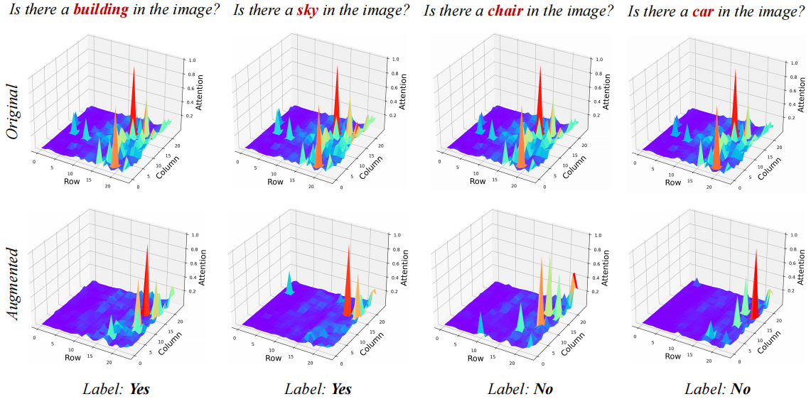
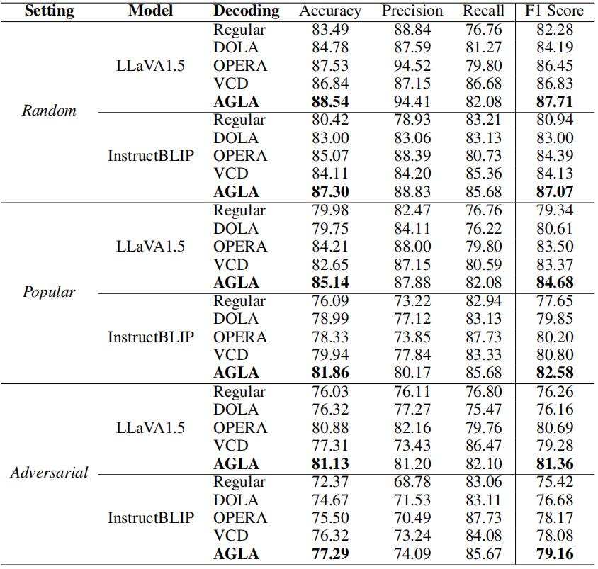

# AGLA: Assembly of Global and Local Attention
The official repo of paper [AGLA: Mitigating Object Hallucinations in Large Vision-Language Models with Assembly of Global and Local Attention](https://arxiv.org/abs/2406.12718).

## Authors
Wenbin An, Feng Tian, Sicong Leng, Jiahao Nie, Haonan Lin, QianYing Wang, Guang Dai, Ping Chen, Shijian Lu.

## Abstract
Large Vision-Language Models (LVLMs) often suffer from *object hallucinations*, where the generated textual responses do not align with the actual objects in the image. This paper identifies *attention deficiency* towards discriminative local image features as a key cause of this issue. We introduce the *Assembly of Global and Local Attention (AGLA)*, a training-free, plug-and-play method designed to reduce object hallucinations by combining global features for response generation and local features for visual discrimination. Our extensive experiments demonstrate that AGLA consistently mitigates object hallucinations and enhances the overall perception capabilities of LVLMs across various discriminative and generative benchmarks.

<div align=center>

</div>

## Content
[1. Data](#data)

[2. Model](#model)

[3. Requirements](#requirements)

[4. Running](#running)

[5. Results](#results)

[6. Thanks](#thanks)

[7. Citation](#citation)

## Data
We conducted experiments using four public datasets:

[1. POPE](https://github.com/AoiDragon/POPE)

[2. MME](https://github.com/BradyFU/Awesome-Multimodal-Large-Language-Models/tree/Evaluation)

[3. CHAIR](https://github.com/yuezih/less-is-more)

[4. LLaVA-Bench-Wild](https://huggingface.co/datasets/liuhaotian/llava-bench-in-the-wild/tree/main)

The question data for *POPE* and *CHAIR* are included in this repository. You will need to download the COCO_val2014 image files separately. For the MME dataset, you can request the data through the provided link. The LLaVA-Bench-Wild dataset can be downloaded from Huggingface via the provided link.

## Model
We experimented with two LVLMs: [LLaVA](https://github.com/haotian-liu/LLaVA) and [InstructBLIP](https://github.com/salesforce/LAVIS). An overview of our model is shown below.
<div align=center>

</div>

## Requirements
The environment is based on Python 3.9. Detailed dependencies are listed in requirements.txt.

## Running
To run experiments on POPE with LLaVA 1.5 or InstructBLIP, use the following commands in the *eval* folder::
```
sh llava1.5_pope.bash
sh instructblip_pope.bash
```
To evaluate model performance on POPE, use *eval_pope.py*.

For other datasets, modify the file paths and prompts in *run_llava.py* and *run_instructblip.py* to generate results and evaluate model performance following the guidance of their original repositories.

## Results
<div align=center>

</div>


## Thanks
The logit adjustment framework (i.e., *sample.py*) is based on [VCD](https://github.com/DAMO-NLP-SG/VCD).

## Citation
If our paper or code is helpful to you, please consider citing our work:
```
@article{an2024agla,
  title={AGLA: Mitigating Object Hallucinations in Large Vision-Language Models with Assembly of Global and Local Attention},
  author={An, Wenbin and Tian, Feng and Leng, Sicong and Nie, Jiahao and Lin, Haonan and Wang, QianYing and Dai, Guang and Chen, Ping and Lu, Shijian},
  journal={arXiv preprint arXiv:2406.12718},
  year={2024}
}
```
